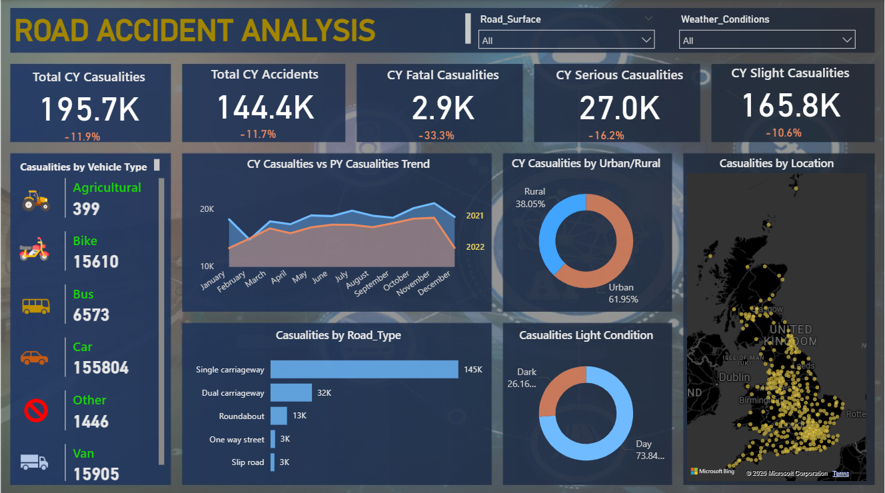

# 🚗 Road Accident Analysis Dashboard (Power BI)

## 📌 Project Overview

This Power BI dashboard analyzes road accident data to uncover trends in casualties, accident severity, vehicle types, road conditions, and environmental factors. The dashboard enables interactive exploration using slicers and KPIs to support data-driven road safety decisions.

---

## Dashboard Preview

---

## Key Insights

- Total Casualties: **195.7K**
- Total Accidents: **144.4K**
- Fatal Casualties: **2.9K**
- Serious Casualties: **27K**
- Slight Casualties: **165.8K**

---

## Dashboard Features

✔ Interactive filters

- Road Surface
- Weather Conditions

✔ KPIs

- Total Casualties
- Total Accidents
- Fatal Casualties
- Serious Casualties
- Slight Casualties

✔ Visualizations

- Casualties by Vehicle Type
- Monthly Casualty Trend
- Urban vs Rural Analysis
- Road Type Analysis
- Day vs Night Casualties
- Accident Location Map

---

## Tools Used

- Power BI
- Power Query
- DAX
- Data Modeling

---

## Skills Demonstrated

- Data Cleaning
- Data Visualization
- KPI Design
- Dashboard Design
- Interactive Reporting
- Business Intelligence

---

## Business Impact

This dashboard helps identify accident-prone areas, high-risk road types, vehicle categories with higher casualties, and environmental conditions affecting road safety, enabling informed decision-making.
